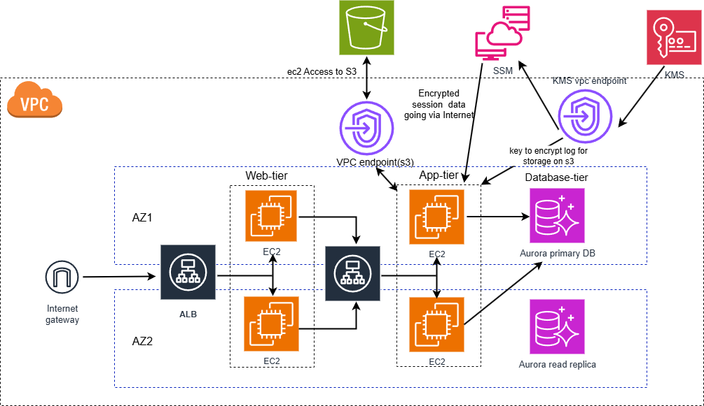

# Deploying a Three-tier Infrastructure With High Availability and Security (Includes KMS-SSM and ec2 session logging to s3)

This is an example Terraform configuration the allows the deployment of a three-tier web architecture on AWS.

## What are the resources used in this architecture?

A VPC

Availability Zones

Internet gateway

NAT gateway

Two public subnets in two availability zones

Four private subnets in two availability zones

Route tables

VPC endpoints for S3 and KMS

Security groups for 

	- Internet-facing load balancer
	- web-tier
	- Internal load balancer
	- App-tier
	- Database-tier
	- vpc endpoint

Load balancers and target groups

Launch templates

auto scaling group

ec2 instance profile with ec2 role containing policy for actions on ssm, s3 and kms 

S3

kms key and policy

SSM

DB subnet group

Aurora-MySQL DB

## Brief description of ec2 interactions

ec2 profile has role for access to KMS, S3 and SSM. When a session is started by a user via the Internet with an ec2 instance in the App-tier
subnet, that session is managed by SSM and encrypted with KMS. 

SSM Agent on EC2 sends encrypted log to S3.  

EC2 has readOnly access to S3 permitting to download configuration files for the application being deployed.

## Brief steps on how this was accomplished

Provisioned the VPC (with SGs, NAT, Subnets etc), ec2-roles, s3 buckets and Aurora-MySQL DB using terraform

Manually launched an ec2 instance in the app-tier private subnet and configure it through ssm

Manually Created an AMI from this instance

Provisioned an internal load balancer with an autoscaling group in a target group using a launch template with the app-teir AMI

Manually launched an ec2 instance in the web-tier public subnet and configure it through ssh

Manually Created an AMI from this instance

Provisioned an internet-facing load balancer with an autoscaling group in a target group using a launch template with the web-teir AMI

